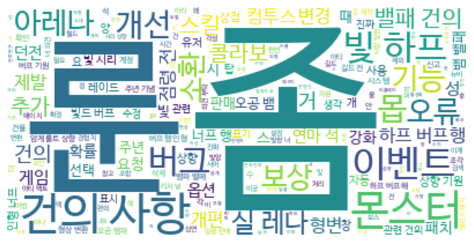
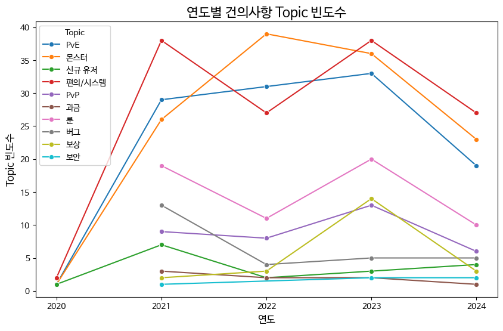
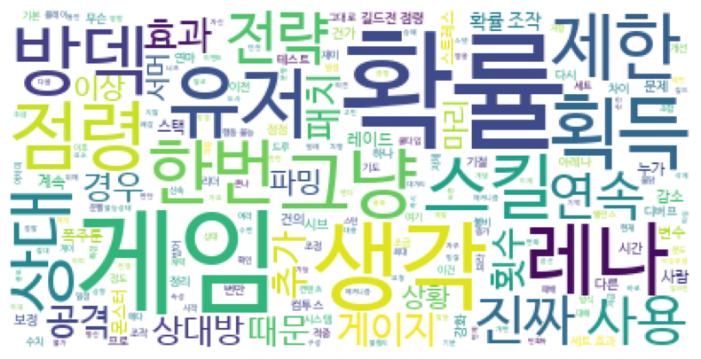
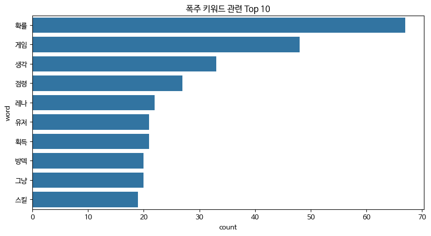
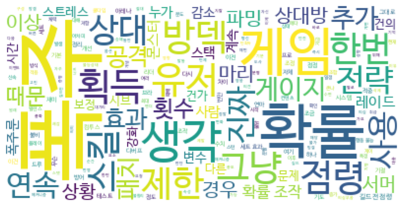
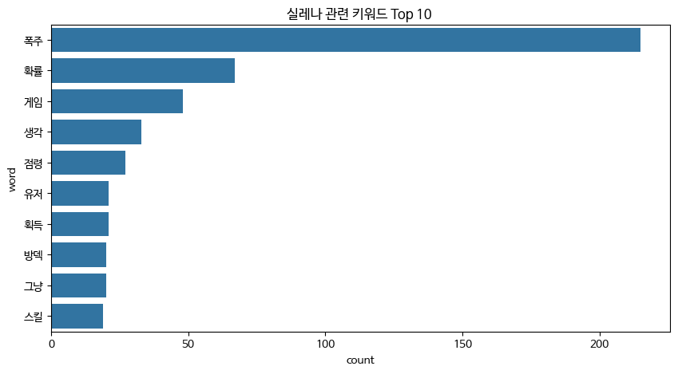

## 서머너즈워 건의사항 분석 및 기획 프로젝트

### Overview

- '2014 대한민국 게임대상'에서 우수상과 기술창작상(기획/시나리오 부문)을 수상한 컴투스의 모바일 게임 서머너즈워가 10주년을 맞았다. 서머너즈워는 본인이 가장 즐겨하는 게임 중 하나로, 이 게임이 더 오랜 시간 서비스를 할 수 있는지, 어떤 것을 발전시켜야 할지 탐구하고자 분석 및 기획 제안 프로젝트를 진행하고자한다.

### 프로젝트 목적
- 공식 카페 건의사항 게시글 분석
- 간단한 기획 방안 생성

### 프로젝트 기간
- 2024.10.22 ~ 2024.11.14

## Dataset
|No.|data|description|
|--|--|--|
|1.|df_suggestion|서머너즈워 공식카페에서의 건의사항 제목 데이터|
|2.|df_suggestion_modified|연도, 날짜 및 데이터 전처리한 데이터|
|3.|df_suggestion_like|좋아요 수 기준으로 정렬한 데이터|
|4.|df_suggestion_rampage|폭주 키워드 관련 본문 텍스트|
|5.|df_suggestion_arena|아레나 키워드 관련 본문 텍스트|

## Process

|Stage|Activity|Date|Comment|Code Link|
|--|--|--|--|--|
|1|데이터 수집 및 전처리|2024.10.22|서머너즈워 네이버 공식 카페 건의사항 게시글 제목 크롤링|[1](https://github.com/SeokcheonMoon/summoners_war_development_analysis/blob/main/1.%20crawling_suggestion_naver_cafe.ipynb)|
|2|키워드 시각화(워드클라우드)|2024.11.07|연도별 키워드 시각화|[2](https://github.com/SeokcheonMoon/summoners_war_development_analysis/blob/main/2.%20analysis_wordcloud.ipynb)|
|3|주제 분석|2024.11.10|좋아요 수 기준 토픽 분석|[3](https://github.com/SeokcheonMoon/summoners_war_development_analysis/blob/main/3.%20analysis_like_counts.ipynb)|
|4|키워드 관련 텍스트 재수집|2024.11.14|서머너즈워 네이버 공식 카페 키워드 관련 본문 크롤링|[4](https://github.com/SeokcheonMoon/summoners_war_development_analysis/blob/main/4.%20crawling_keyword_text.ipynb)|
|5|특정 키워드 분석 시각화|2024.11.14|본문 텍스트에서 키워드 추출 및 시각화|[5](https://github.com/SeokcheonMoon/summoners_war_development_analysis/blob/main/5.%20analysis_keyword.ipynb)|
||업데이트 방안 제시|2024.11.14|건의사항에 대한 해결 방안 작성||
|6|차후 건의사항 수집 이후 토픽 분류 모델 생성|~|||

## 분석 결과

### 1. 연도별 워드클라우드

- 연도별 기준을 나누어 어떤 문제점들을 이야기하는지 키워드 탐색
- 워드클라우드로 시각화

### 2. 연도별 건의사항 토픽별 빈도수

- 좋아요 수 1개 이상인 텍스트들에 대해 토픽 부여
- 주제가 될 만한 키워드들을 생성 후 각 텍스트에 주제 할당 이후 시각화
- 대체적으로 매년 편의/시스템 기능, 몬스터, PvE, 룬 문제에 대한 건의사항이 많다는 것을 볼 수 있음. 
- 다만, 다른 topic의 건의사항은 많이 없다는 것이 아니라 공감을 받은 건의사항에 대한 지표일 뿐임.

### 3. 핵심 키워드 관련 게시글 분석

#### (1) 폭주 키워드 관련 본문 텍스트

- 폭주는 발동 확률에 대한 언급이 가장 많아보인다.
- 점령전, 실시간 아레나, 방덱, 턴 획득과 관련이 있으며 게임에 영향이 큰 것으로 보임.
#### (2) 실시간 아레나 키워드 관련 본문 텍스트

- 폭주와 연관이 가장 큼. 실시간 아레나에서의 폭주 영향력을 유추할 수 있음.
- 마찬가지로 확률에 대한 건의사항이 잦음.

=> 즉 폭주, 실시간 아레나는 깊은 연관성을 가지고 있음을 알 수 있다.

### 4. 기획

#### (1) 매판 리플레이 영상을 수집하고 데이터를 공식적으로 공개
    + 폭주 발동률이 정상적으로 작동하는지를 유저들에게 확인시켜줄 필요가 있음.
    + 공식적인 입장을 통해 입증하여 유저들에게 보여준다면 민심 확보에 큰 영향을 줄 것임.
    + 기대 효과 : 중
#### (2) 실시간 아레나에서 폭주룬 발동 x -> 다른 룬으로 대체
    + 폭주는 PVP에서 역전의 발판으로 자주 사용되지만, 유저는 확률에 의존한 채 플레이할 수 밖에 없음.
    + 하지만 폭주룬 발동을 stop하면 폭주룬 다보유자들에게 불만이 있을 것임.
    + 폭주룬을 다른 룬으로 대체해주는 기능 추가.
    + 기대 효과 : 중
#### (3) 몬스터 밸런스 패치 대중화
    + 밸런스 업데이트에 대한 부분은 기획팀이 독자적으로 판단하는 것에는 무리가 있다고 생각함.(플레이 스타일, 유저와의 소통 등)
    + 밸런스 패치에 대한 유저 평가단을 선정하여 평가단의 판단에 무게를 두고 업데이트 여부를 판단.
    + 보다 더 대중적으로 의견을 받을 수 있기에 큰 도움이 될 것임.
    + 기대 효과 : 상

## Reference
- [서머너즈워 네이버 공식 카페](https://cafe.naver.com/smonwar)